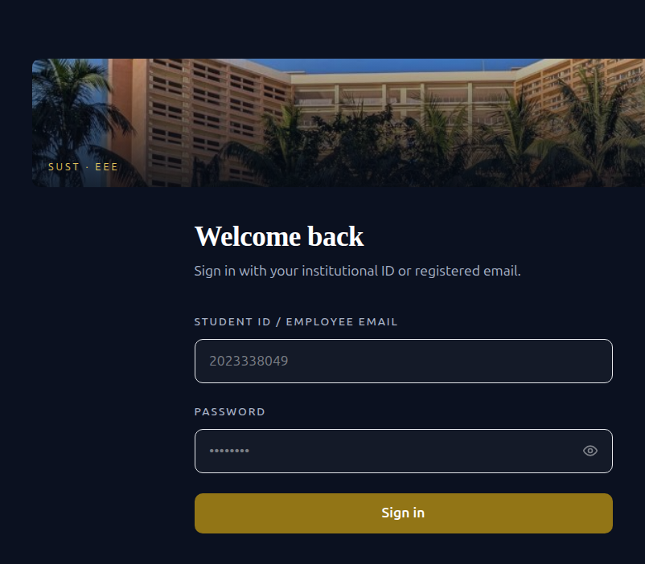
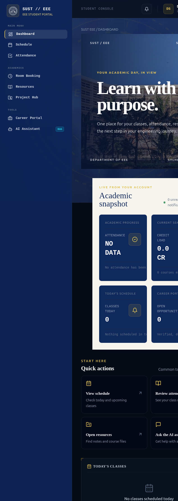

# SUST EEE Smart Student Portal

The SUST EEE Smart Student Portal is a full-stack academic platform for the Department of Electrical and Electronic Engineering at Shahjalal University of Science and Technology, Sylhet, Bangladesh.

It brings course planning, attendance, room and lab booking, resources, projects, career services, AI-assisted academic search, notifications, and alumni engagement into one role-aware portal.

[](docker-compose.yml)
[](backend)
[](frontend)
[](database)
[](LICENSE)

> A department-focused portal that turns everyday academic work into one clear, measurable workflow.


**Try it locally:** `docker compose up --build -d postgres redis minio backend celery_worker celery_beat frontend`
**Open the app:** [localhost:5173](http://localhost:5173)

## Product Preview

The screenshots below are captured from the running local application, not mockups.

### Sign in



### Student home



The student home combines a campus-led visual introduction with live academic metrics, quick actions, today's classes, and attendance status. Demo credentials are intentionally not published in the repository.

## What It Includes

| Area | Highlights |
| --- | --- |
| Authentication | JWT access tokens, rotated refresh tokens, HttpOnly refresh cookies, and RBAC |
| Academic operations | Course enrolment, schedules, attendance, credit-hour validation, and department dashboards |
| Booking | Room and lab booking with PostgreSQL GiST conflict prevention |
| Resources | Presigned S3/MinIO uploads and PostgreSQL full-text search |
| Projects | Capstone lifecycle, supervisor workflows, and GitHub integration |
| Career | Opportunities, JSON-Resume profiles, and public portfolios |
| Notifications | Firebase Cloud Messaging with Celery worker and Beat scheduling |
| AI assistant | Google Gemini with pgvector and full-text hybrid retrieval |
| Alumni portal | Alumni verification, directory search, visibility controls, events, mentorship, scholarships, news, and gallery foundations |

## Dashboard Experience

The signed-in frontend uses an academic editorial direction rather than a generic admin template:

- SUST campus image-led student homepage
- Navy and muted amber palette
- Serif academic headings, readable sans-serif body copy, and tabular mono data
- Live dashboard metrics from `GET /api/v1/dashboard/summary`
- Role-specific sections for students, CRs, teachers, lab assistants, alumni, and admins
- Schedule, attendance, resources, AI assistant, and career quick actions
- Loading skeletons and explicit empty states instead of fabricated numbers

## Product Highlights

### A dashboard that explains itself

The first screen is designed for a real student workflow: a campus-led welcome area, an academic snapshot, today's classes, attendance standing, and shortcuts to the tools students use most. The interface favours hierarchy and whitespace over noisy decoration.

### Trustworthy data states

- Attendance percentages are calculated from recorded attendance rows.
- Schedule cards are scoped to the signed-in student's enrolments.
- Empty databases show `No data` or a useful empty state instead of invented metrics.
- Admin and alumni counts are returned by protected, role-aware API endpoints.

### Premium interaction details

- Skeleton loading states keep the layout stable while data loads.
- Subtle border and elevation changes provide feedback without distracting glow effects.
- Deep-linkable cards take users directly to schedule, attendance, resources, career, or the AI assistant.
- Responsive layouts preserve the visual hierarchy on laptop, tablet, and mobile screens.

## Why This Project

University departments often split attendance, schedules, notices, rooms, resources, and alumni records across spreadsheets and chat groups. This project treats those workflows as one connected system, with permissions and database constraints designed around the people who use it.

The goal is not only to show screens. It is to make the important answers easy to find:

- What classes do I have today?
- Is my attendance on track?
- Which resources or opportunities are relevant to me?
- What needs an admin's approval?
- How can alumni stay visible, connected, and useful to current students?

## Share This Project

Short description for LinkedIn, Facebook, or a portfolio:

> I built the SUST EEE Smart Student Portal, a full-stack academic platform for the Department of EEE at SUST. It combines JWT/RBAC authentication, live role-based dashboards, attendance and scheduling, conflict-aware bookings, resources, career tools, an AI academic assistant, and an alumni portal using FastAPI, React, PostgreSQL, Redis, Celery, and Docker.

Suggested tags: `#FastAPI` `#ReactJS` `#TypeScript` `#PostgreSQL` `#Docker` `#EdTech` `#OpenSource`

## Architecture

```text
React + TypeScript + Vite
                              |
                              v
FastAPI + SQLAlchemy async + JWT/RBAC
                              |
                              +--> PostgreSQL 16 + pgvector + GiST + tsvector
                              +--> Redis --> Celery worker / Beat
                              +--> MinIO or AWS S3 presigned storage
                              +--> Firebase Cloud Messaging
                              +--> Google Gemini API
```

The backend is organised by domain across API endpoints, schemas, services, repositories, models, and tasks. Database changes are mirrored in `database/schema.sql`, numbered SQL migrations, and Alembic revisions.

## Tech Stack

- **Frontend:** React 18, TypeScript, Vite, React Router, Tailwind CSS, TanStack Query, Lucide icons
- **Backend:** FastAPI, Python 3.11, SQLAlchemy 2 async, Pydantic v2, Alembic
- **Database:** PostgreSQL 16, `btree_gist`, `vector`, GiST exclusion constraints, PostgreSQL full-text search
- **Infrastructure:** Docker Compose, Redis, Celery, MinIO/AWS S3
- **Integrations:** Firebase FCM, Google Gemini, GitHub webhooks

## Getting Started

### Prerequisites

- Docker Engine and Docker Compose v2
- Git

### Configure

```bash
git clone https://github.com/kakonRoy150636/Student-Portal-of-EEE-SUST.git
cd Student-Portal-of-EEE-SUST
cp .env.example .env
```

Update `.env` before using external services. At minimum, change `SECRET_KEY` for any non-local environment. Gemini and Firebase credentials are optional for the core dashboard, but required by their respective integrations.

### Run the local stack

The core application services are:

```bash
docker compose up --build -d postgres redis minio backend celery_worker celery_beat frontend
```

Open:

- Frontend: <http://localhost:5173>
- Backend health: <http://localhost:8000/health>
- API documentation: <http://localhost:8000/api/docs>
- OpenAPI schema: <http://localhost:8000/openapi.json>
- MinIO API: <http://localhost:9000>
- MinIO console: <http://localhost:9001>
- PostgreSQL: `localhost:5433`
- Redis: `localhost:6380`

The compose file also contains a `minio-init` bucket initializer. If the `minio/mc` image is unavailable in your registry, start the core services with the command above and create the `sust-eee-resources` bucket from the MinIO console before testing uploads.

### Frontend-only development

```bash
npm --prefix frontend install
npm --prefix frontend run dev
```

### Backend tests

The backend image installs the development extras from `backend/pyproject.toml`.

```bash
docker compose exec -T backend python -m pytest -q
docker compose exec -T backend python -m pytest -q tests/test_schema_parity.py
```

The schema parity test checks that ORM columns and the bootstrap schema remain aligned. Test failures involving external services require the relevant Redis, PostgreSQL, MinIO, Firebase, or Gemini configuration.

### Build the frontend

```bash
npm --prefix frontend run build
```

## User Roles

| Role | Main access |
| --- | --- |
| Student | Enrolment, schedule, attendance, room booking, resources, projects, career, and AI assistant |
| Class Representative | Student workflows plus class coordination and CR tools |
| Teacher | Course and attendance management, approvals, lab workflows, and project supervision |
| Lab Assistant / ER | Lab inventory, equipment checkout, damage reports, and assigned lab workflows |
| Alumni | Verified alumni profile, directory, alumni events, mentorship, scholarships, and alumni dashboard |
| Super Admin | User approval, department configuration, analytics, and administrative controls |

## Repository Layout

```text
backend/
      app/api/v1/endpoints/    FastAPI route modules
      app/models/              SQLAlchemy models
      app/repositories/        Database access
      app/schemas/             Pydantic request/response models
      app/services/            Domain logic
      app/tasks/               Celery tasks
      tests/                   Pytest suite
database/
      schema.sql               Fresh-install bootstrap schema
      migrations/              Numbered idempotent SQL migrations
frontend/src/
      features/                Domain pages and API clients
      components/              Shared UI and layout components
      routes/                  React Router configuration
      contexts/                Auth and theme state
```

## Suggested Demo Flow

Use this short path when presenting the project:

1. Sign in as a student and show the campus-led dashboard.
2. Point out the live academic snapshot and explain where each value comes from.
3. Open today's schedule and attendance to demonstrate role-scoped data.
4. Use a quick action to open resources or the AI assistant.
5. Sign in as an admin to show approval queues and department-level summaries.
6. Sign in as an alumni user to show the verified profile and directory experience.

## Engineering Quality

- Domain-oriented backend structure with thin API endpoints.
- Async database access with SQLAlchemy 2 and PostgreSQL constraints for conflict prevention.
- Idempotent SQL migrations mirrored across bootstrap SQL, numbered migrations, and Alembic.
- Security-sensitive uploads use ownership checks, server-side object validation, and presigned storage.
- Focused tests cover authentication, security, dashboard contracts, alumni flows, and ORM/schema parity.

## Roadmap

- Complete public alumni landing content and media management
- Expand alumni events, scholarship applications, mentorship flows, and career bridging
- Add production observability and department analytics
- Improve mobile navigation and PWA support
- Support additional university departments after EEE validation
- Add automated CI checks for backend tests and frontend builds
- Publish a short product demo and screenshots for each role

## Contributing

1. Fork the repository.
2. Create a feature branch: `git checkout -b feature/your-change`.
3. Run the focused tests and frontend build.
4. Keep migrations, ORM models, and bootstrap SQL aligned.
5. Open a pull request with the motivation, implementation, and validation steps.

## License

Distributed under the MIT License. See [LICENSE](LICENSE).

## Author

**Kakon Roy**
EEE, SUST | [GitHub](https://github.com/kakonRoy150636)
